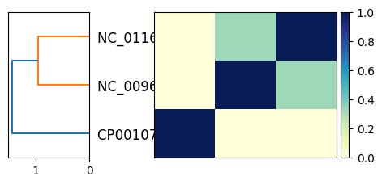

# sourmash_plugin_betterplot

## What is this?

[`sourmash compare`](https://sourmash.readthedocs.io/en/latest/command-line.html#sourmash-compare-compare-many-signatures)
and
[`sourmash plot`](https://sourmash.readthedocs.io/en/latest/command-line.html#sourmash-plot-cluster-and-visualize-comparisons-of-many-signatures)
produce basic distance matrix plots that are useful for comparing and
visualizing the relationships between dozens to hundreds of
genomes. And this is one of the most popular use cases for sourmash!

But! The visualization could be improved a lot beyond the basic viz
that `sourmash plot` produces, and there are a lot of only slightly
more complicated use cases for comparing, clustering, and visualizing
many genomes!

This plugin will explore these use cases!

Specific goals:

* provide a variety of plotting and exploration commands that can be used
  with sourmash tools;
* provide both command-line functionality _and_ functions that can be
  imported and used in Jupyter notebooks;
* (maybe) explore other backends than matplotlib;

and who knows what else??

## Installation

```
pip install sourmash_plugin_betterplot
```

## Usage

@CTB: info goes here!

## Examples

```
sourmash scripts plot2 3sketches.cmp -o examples/plot2.3sketches.cmp.png
```
yields:


## Support

We suggest filing issues in [the main sourmash issue tracker](https://github.com/dib-lab/sourmash/issues) as that receives more attention!

## Dev docs

`betterplot` is developed at https://github.com/sourmash-bio/sourmash_plugin_betterplot.

### Testing

Run:
```
pytest tests
```

### Generating a release

Bump version number in `pyproject.toml` and push.

Make a new release on github.

Then pull, and:

```
python -m build
```

followed by `twine upload dist/...`.

---

CTB May 2024
