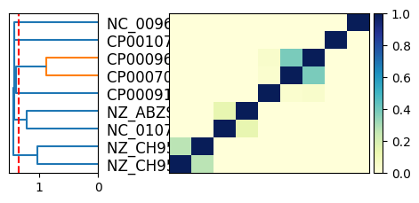

# sourmash_plugin_betterplot

## What is this?

[`sourmash compare`](https://sourmash.readthedocs.io/en/latest/command-line.html#sourmash-compare-compare-many-signatures)
and
[`sourmash plot`](https://sourmash.readthedocs.io/en/latest/command-line.html#sourmash-plot-cluster-and-visualize-comparisons-of-many-signatures)
produce basic distance matrix plots that are useful for comparing and
visualizing the relationships between dozens to hundreds of
genomes. And this is one of the most popular use cases for sourmash!

But! The visualization could be improved a lot beyond the basic viz
that `sourmash plot` produces, and there are a lot of only slightly
more complicated use cases for comparing, clustering, and visualizing
many genomes!

This plugin will explore these use cases!

Specific goals:

* provide a variety of plotting and exploration commands that can be used
  with sourmash tools;
* provide both command-line functionality _and_ functions that can be
  imported and used in Jupyter notebooks;
* (maybe) explore other backends than matplotlib;

and who knows what else??

## Installation

```
pip install sourmash_plugin_betterplot
```

## Usage

@CTB: info goes here!

## Examples

The command lines below are executable in the `examples/` subdirectory
of the repository after installing the plugin.

### Basic 3 sketches example: plot2

Compare 3 sketches, and cluster.

This command:
```
sourmash compare sketches/{2,47,63}.sig.zip -o 3sketches.cmp
    --labels-to 3sketches.cmp.labels_to.csv

sourmash scripts plot2 3sketches.cmp 3sketches.cmp.labels_to.csv \
    -o examples/plot2.3sketches.cmp.png
```

produces this plot:


### 3 sketches example with a cut line: plot2 --cut-point 1.2

Compare 3 sketches, cluster, and show a cut point.

This command:
```
sourmash compare sketches/{2,47,63}.sig.zip -o 3sketches.cmp
    --labels-to 3sketches.cmp.labels_to.csv

sourmash scripts plot2 3sketches.cmp 3sketches.cmp.labels_to_csv \
    -o examples/plot2.cut.3sketches.cmp.png \
    --cut-point=1.2
```

produces this plot:


### Dendrogram of 10 sketches with a cut line + cluster extraction

Compare 10 sketches, cluster, and use a cut point to extract
multiple clusters. Use `--dendrogram-only` to plot just the dendrogram.

This command:
```
sourmash compare sketches/{2,47,48,49,51,52,53,59,60}.sig.zip \
    -o 10sketches.cmp \
    --labels-to 10sketches.cmp.labels_to.csv

sourmash scripts plot2 10sketches.cmp 10sketches.cmp.labels_to.csv \
    -o plot2.cut.10sketches.cmp.png \
    --cut-point=1.35 --cluster-out --dendrogram-only
```

produces this plot:



as well as this set of clusters @CTB.

### Multidimensional Scaling (MDS) plot of 10-sketch comparison

Use MDS to display a comparison.

This command:
```
sourmash compare sketches/{2,47,48,49,51,52,53,59,60}.sig.zip \
    -o 10sketches.cmp \
    --labels-to 10sketches.cmp.labels_to.csv

sourmash scripts mds 10sketches.cmp -o mds.10sketches.cmp.png
```

produces this plot:


## Support

We suggest filing issues in [the main sourmash issue tracker](https://github.com/dib-lab/sourmash/issues) as that receives more attention!

## Dev docs

`betterplot` is developed at https://github.com/sourmash-bio/sourmash_plugin_betterplot.

### Testing

Run:
```
pytest tests
```

### Generating a release

Bump version number in `pyproject.toml` and push.

Make a new release on github.

Then pull, and:

```
python -m build
```

followed by `twine upload dist/...`.

---

CTB May 2024
