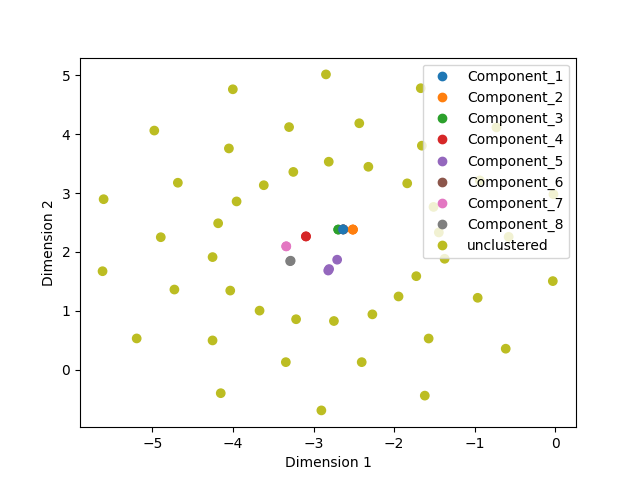
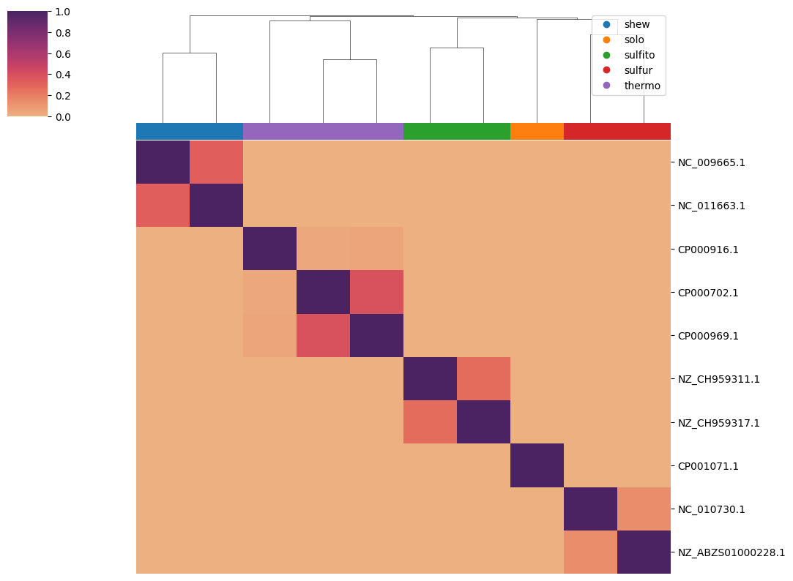
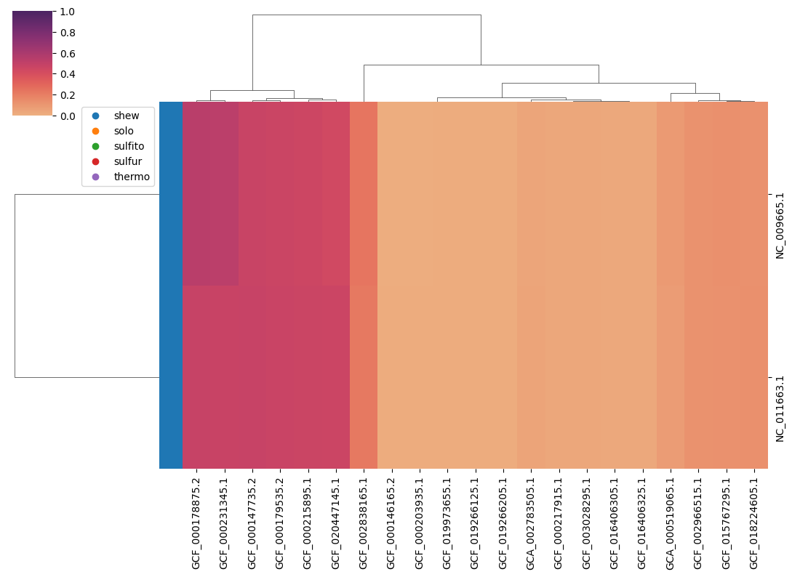
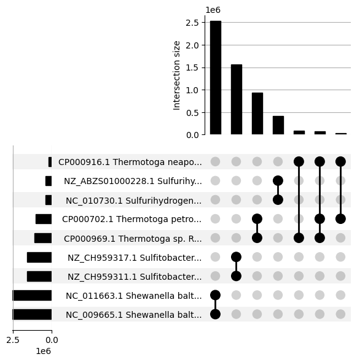

# sourmash_plugin_betterplot

[sourmash](https://sourmash.readthedocs.io/) is a tool for biological
sequence analysis and comparisons.

`betterplot` is a sourmash plugin that provides improved plotting/viz
and cluster examination for sourmash-based sketch comparisons. It
includes better similarity matrix plotting, MDS plots, and
clustermaps, as well as support for coloring samples based on
categories. It also includes support for sparse comparison output
formats produced by the fast multithreaded `manysearch` and `pairwise`
functions in the
[branchwater plugin for sourmash](https://github.com/sourmash-bio/sourmash_plugin_branchwater).

## Why does this plugin exist?

[`sourmash compare`](https://sourmash.readthedocs.io/en/latest/command-line.html#sourmash-compare-compare-many-signatures)
and
[`sourmash plot`](https://sourmash.readthedocs.io/en/latest/command-line.html#sourmash-plot-cluster-and-visualize-comparisons-of-many-signatures)
produce basic distance matrix plots that are useful for comparing and
visualizing the relationships between dozens to hundreds of
genomes. And this is one of the most popular use cases for sourmash!

However, the visualization can be improved a lot beyond the basic viz
that `sourmash plot` produces. There are a lot of only slightly more
complicated use cases for comparing, clustering, and visualizing many
genomes!

And this plugin exists to explore some of these use cases!

General goals:

* provide a variety of plotting and exploration commands that can be used
  with sourmash tools;
* provide both command-line functionality _and_ functions that can be
  imported and used in Jupyter notebooks;
* (maybe) explore other backends than matplotlib;

and who knows what else??

### What does this plugin provide?

As of v0.4, the betterplot plugin provides:

* improved similarity matrix visualization, along with cluster extraction;
* multidimensional scaling (MDS) plots;
* t-Stochastic Neighbor Embedding (tSNE) plots;
* non-square matrix visualization for the output of `manysearch`;
* an upset plot to visualize intersections between sketches;
* a utility function to convert `pairwise` output into a similarity matrix;
* a utility function to convert `cluster` output into color categories;

## Installation

```
pip install sourmash_plugin_betterplot
```

## Usage

See the examples below for some example command lines and output,
and use command-line help (`-h/--help`) to see available options.

### Labels on plots: the `labels-to` CSV file.

The `labels-to` CSV file taken by most (all?) of the comparison matrix
plotting functions (e.g. `plot2`, `plot3`, `mds`) is the same format
output by
[`sourmash compare ... --labels-to <file>`](https://sourmash.readthedocs.io/en/latest/command-line.html#sourmash-compare-compare-many-signatures)
and loaded by `sourmash plot --labels-from <file>`. The format is
hopefully obvious, but there are a few things to mention -

* the `sort_order` column specifies the order of the columns with respect
  to the samples in the distance matrix.  This is there to support arbitrary
  re-arranging and processing of the CSV file.
* the `label` column is the name that will be displayed on the plot, as well as
  for the default "categories" CSV matching (see below). You can edit this
  by hand (spreadsheet, text editor) or programmatically.
* as a side note, the `labels.txt` file output by `sourmash compare`
  is entirely ignored ;).

### Categories on plots: the "categories" CSV file

One of the nice features of the betterplot functions is the ability to
provide categories that color the plots. This is critical for some
plots - for example, the `mds` and `mds2` plots don't make much sense
without colors! - and nice for other plots, like `plot3` and
`clustermap1`, where you can color columns/rows by category.

To make use of this feature, you need to provide a "categories" CSV
file (typically `-C/--categories-csv`). This file is reasonably flexible
in format; it must contain at least two columns, one named `category`,
but can contain more as long as `category` is provided.

The simplest possible categories CSV format is shown in
[10sketches-categories.csv](examples/sketches/10sketches-categories.csv), and
it contains two columns, `label` and `category`.  When this file is
loaded, `label` is matched to the name of each point/row/column, and
that point is then assigned that category.

Additional flexibility is provided by the column matching.

Some restrictions of / observations on the current implementation:
* if a categories CSV is provided, every point must have an
  associated category. It should be possible to have MORE many points and
  categories - checkme, @CTB!
* there is currently no way to specify a specific color for a
  category; they get assigned at random.
* it is entirely OK to edit the labels file (see above) and just add
  a `category` column. This won't be picked up by the
  code automatically - you'll need to specify the same file via `-C` -
  but it works fine!

## Examples

The command lines below are executable in the `examples/` subdirectory
of the repository after installing the plugin.

### `plot2` - basic 3 sketches example

Compare 3 sketches with `sourmash compare`, and cluster.

This command:
```
sourmash compare sketches/{2,47,63}.sig.zip -o 3sketches.cmp \
    --labels-to 3sketches.cmp.labels_to.csv

sourmash scripts plot2 3sketches.cmp 3sketches.cmp.labels_to.csv \
    -o plot2.3sketches.cmp.png
```

produces this plot:


### `plot2` - 3 sketches example with a cut line: plot2 --cut-point 1.2

Compare 3 sketches with `sourmash compare`, cluster, and show a cut point.

This command:
```
sourmash compare sketches/{2,47,63}.sig.zip -o 3sketches.cmp \
    --labels-to 3sketches.cmp.labels_to.csv

sourmash scripts plot2 3sketches.cmp 3sketches.cmp.labels_to.csv \
    -o plot2.cut.3sketches.cmp.png \
    --cut-point=1.2
```

produces this plot:


### `plot2` - dendrogram of 10 sketches with a cut line + cluster extraction

Compare 10 sketches with `sourmash compare`, cluster, and use a cut
point to extract multiple clusters. Use `--dendrogram-only` to plot
just the dendrogram.

This command:
```
sourmash compare sketches/{2,47,48,49,51,52,53,59,60,63}.sig.zip \
    -o 10sketches.cmp \
    --labels-to 10sketches.cmp.labels_to.csv

sourmash scripts plot2 10sketches.cmp 10sketches.cmp.labels_to.csv \
    -o plot2.cut.dendro.10sketches.cmp.png \
    --cut-point=1.35 --cluster-out --dendrogram-only
```

produces this plot:


as well as a set of 6 clusters to `10sketches.cmp.*.csv`.

### `mds`- multidimensional Scaling (MDS) from `sourmash compare` output

Use MDS to display a comparison generated by `sourmash compare`.

These commands:
```
sourmash compare sketches/{2,47,48,49,51,52,53,59,60,63}.sig.zip \
    -o 10sketches.cmp \
    --labels-to 10sketches.cmp.labels_to.csv

sourmash scripts mds 10sketches.cmp 10sketches.cmp.labels_to.csv \
    -o mds.10sketches.cmp.png \
    -C sketches/10sketches-categories.csv
```

produces this plot:


By default this command generates a metric MDS plot.  You can generate
a non-metric (NMDS) plot with `--nmds`.

### `mds2` - multidimensional Scaling (MDS) plot from `pairwise` output

Use MDS to display a sparse comparison created using the
[branchwater plugin's](https://github.com/sourmash-bio/sourmash_plugin_branchwater)
`pairwise` command. The output of `pairwise` is distinct from the
`sourmash compare` output: `pairwise` produces a sparse CSV file that
contains just the matches above threshold, while `sourmash compare`
produces a dense numpy matrix.

These commands:
```
sourmash sig cat sketches/{2,47,48,49,51,52,53,59,60,63}.sig.zip \
    -o 10sketches.sig.zip
sourmash scripts pairwise 10sketches.sig.zip -o 10sketches.pairwise.csv

sourmash scripts mds2 10sketches.pairwise.csv \
    -o mds2.10sketches.cmp.png \
    -C sketches/10sketches-categories.csv
```

produces this plot:


By default this command generates a metric MDS plot.  You can generate
a non-metric (NMDS) plot with `--nmds`.

### `cluster_to_categories` - convert clusters from `cluster` into categories

The `sourmash scripts cluster` command from
[the branchwater plugin](https://github.com/sourmash-bio/sourmash_plugin_branchwater)
will cluster `pairwise` output; `cluster_to_categories` converts these clusters
into a categories CSV that can be used to color points and columns/rows.

These commands:
```
# generate pairwise comparison
sourmash scripts pairwise sketches/64sketches.sig.zip -o 64sketches.pairwise.csv \
    --write-all

# generate clusters
sourmash scripts cluster 64sketches.pairwise.csv \
    -o 64sketches.pairwise.clusters.csv \
    --similarity jaccard -t 0 

# convert to categories CSV
sourmash scripts cluster_to_categories 64sketches.pairwise.csv \
    64sketches.pairwise.clusters.csv -o 64sketches.pairwise.clusters.cats.csv
```

produce `64sketches.pairwise.clusters.cats.csv`, which categorizes the
input samples based on their cluster membership.

### `tsne` - tSNE plot of comparisons from `sourmash compare` output

t-distributed stochastic neighbor embedding (t-SNE) is another method
for visualizing high-dimensional data in two dimensions.  The `tsne`
command displays a comparison generated by `sourmash compare`.

These commands:

```
sourmash compare sketches/64sketches.sig.zip -o 64sketches.cmp \
    --labels-to 64sketches.cmp.labels_to.csv
    
sourmash scripts tsne 64sketches.cmp 64sketches.cmp.labels_to.csv \
    -C 64sketches.pairwise.clusters.cats.csv -o tsne.64sketches.cmp.png
```

produce this plot:


(The `64sketches.pairwise.clusters.cats.csv` is generated by the
`cluster_to_categories` command above.)

### `tsne2` - tSNE plot of comparisons from `pairwise` output.

These commands:

```
sourmash scripts pairwise sketches/64sketches.sig.zip -o 64sketches.pairwise.csv \
    --write-all
    
sourmash scripts tsne2 64sketches.pairwise.csv \
    -C 64sketches.pairwise.clusters.cats.csv -o tsne2.64sketches.cmp.png
```

produce this plot:



(The `64sketches.pairwise.clusters.cats.csv` is generated by the
`cluster_to_categories` command above.)

### `pairwise_to_matrix` - convert `pairwise` output to `sourmash compare` output and plot

Convert the sparse comparison CSV (created using the
[branchwater plugin's `pairwise` command](https://github.com/sourmash-bio/sourmash_plugin_branchwater)) into a `sourmash compare`-style similarity matrix.

These commands:
```
# build pairwise
sourmash sig cat sketches/{2,47,48,49,51,52,53,59,60,63}.sig.zip \
    -o 10sketches.sig.zip
sourmash scripts pairwise 10sketches.sig.zip -o 10sketches.pairwise.csv

# convert pairwise
sourmash scripts pairwise_to_matrix 10sketches.pairwise.csv \
    -o 10sketches.pairwise.cmp \
    --labels-to 10sketches.pairwise.cmp.labels_to.csv
    
# plot!
sourmash scripts plot2 10sketches.pairwise.cmp \
    10sketches.pairwise.cmp.labels_to.csv \
    -o plot2.pairwise.10sketches.cmp.png
```

produce this plot:


### `plot3` - seaborn clustermap with color categories

Plot a `sourmash compare` similarity matrix using the
[`seaborn` clustermap](https://seaborn.pydata.org/generated/seaborn.clustermap.html), which
offers some nice visualization options.

These commands:
```
sourmash compare sketches/{2,47,48,49,51,52,53,59,60,63}.sig.zip \
    -o 10sketches.cmp \
    --labels-to 10sketches.cmp.labels_to.csv

sourmash scripts plot3 10sketches.cmp 10sketches.cmp.labels_to.csv \
    -o plot3.10sketches.cmp.png -C sketches/10sketches-categories.csv
```

produce this plot:



### `clustermap1` - seaborn clustermap for non-symmetric matrices

Plot the sparse comparison CSV (created using the
[branchwater plugin's `manysearch` command](https://github.com/sourmash-bio/sourmash_plugin_branchwater)) using seaborn's clustermap. Supports separate
category coloring on rows and columns.

These commands:
```
sourmash sig cat sketches/{2,47,48,49,51,52,53,59,60,63}.sig.zip \
    -o 10sketches.sig.zip

sourmash scripts manysearch 10sketches.sig.zip \
    sketches/shew21.sig.zip -o 10sketches.manysearch.csv

sourmash scripts clustermap1 10sketches.manysearch.csv \
    -o clustermap1.10sketches.png \
    -u containment -R sketches/10sketches-categories.csv
```

produce:



### `upset` - plot sketch intersections using UpSetPlot

Plot an [UpSetPlot](https://upsetplot.readthedocs.io/en/stable/) of the
intersections between sketches.

This command:
```
sourmash scripts upset 10sketches.sig.zip -o 10sketches.upset.png
```

produces:



### `venn` - plot 2- or 3-way sketch intersections using Venn diagrams

Plot a Venn diagram of the intersections between two or three sketches.

This command:
```
sourmash scripts venn sketches/{2,47,63}.sig.zip \
    -o 3sketches.venn.png --ident
```

produces:


## Support

We suggest filing issues in [the main sourmash issue tracker](https://github.com/dib-lab/sourmash/issues) as that receives more attention!

## Dev docs

`betterplot` is developed at
https://github.com/sourmash-bio/sourmash_plugin_betterplot.

See `environment.yml` for the dependencies needed to develop `betterplot`.

### Testing

Run:
```
make examples
```
to run the examples.

For now, the examples serve as the tests; eventually we will add unit tests.

### Generating a release

Bump version number in `pyproject.toml` and push.

Make a new release on github.

Then pull, and:

```
python -m build
```

followed by `twine upload dist/...`.

---

CTB June 2024
