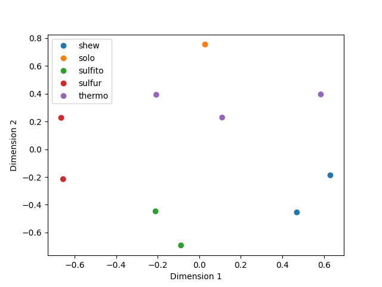
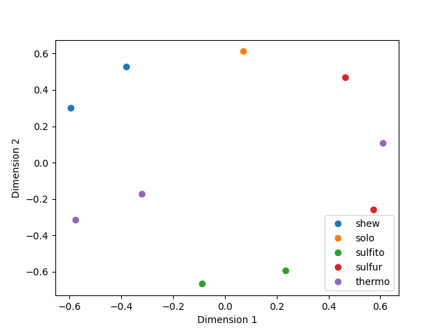

# sourmash_plugin_betterplot

[sourmash](https://sourmash.readthedocs.io/) is a tool for biological
sequence analysis and comparisons.

`betterplot` is a sourmash plugin that provides improved plotting/viz
and cluster examination for sourmash-based sketch comparisons.

## Why does this plugin exist?

[`sourmash compare`](https://sourmash.readthedocs.io/en/latest/command-line.html#sourmash-compare-compare-many-signatures)
and
[`sourmash plot`](https://sourmash.readthedocs.io/en/latest/command-line.html#sourmash-plot-cluster-and-visualize-comparisons-of-many-signatures)
produce basic distance matrix plots that are useful for comparing and
visualizing the relationships between dozens to hundreds of
genomes. And this is one of the most popular use cases for sourmash!

However, the visualization can be improved a lot beyond the basic viz
that `sourmash plot` produces. There are a lot of only slightly more
complicated use cases for comparing, clustering, and visualizing many
genomes!

And this plugin exists to explore some of these use cases!

Specific goals:

* provide a variety of plotting and exploration commands that can be used
  with sourmash tools;
* provide both command-line functionality _and_ functions that can be
  imported and used in Jupyter notebooks;
* (maybe) explore other backends than matplotlib;

and who knows what else??

## Installation

```
pip install sourmash_plugin_betterplot
```

## Usage

See the examples below.

## Examples

The command lines below are executable in the `examples/` subdirectory
of the repository after installing the plugin.

### `plot2` - basic 3 sketches example

Compare 3 sketches, and cluster.

This command:
```
sourmash compare sketches/{2,47,63}.sig.zip -o 3sketches.cmp
    --labels-to 3sketches.cmp.labels_to.csv

sourmash scripts plot2 3sketches.cmp 3sketches.cmp.labels_to.csv \
    -o examples/plot2.3sketches.cmp.png
```

produces this plot:


### `plot2` - 3 sketches example with a cut line: plot2 --cut-point 1.2

Compare 3 sketches, cluster, and show a cut point.

This command:
```
sourmash compare sketches/{2,47,63}.sig.zip -o 3sketches.cmp
    --labels-to 3sketches.cmp.labels_to.csv

sourmash scripts plot2 3sketches.cmp 3sketches.cmp.labels_to_csv \
    -o examples/plot2.cut.3sketches.cmp.png \
    --cut-point=1.2
```

produces this plot:


### `plot2` - dendrogram of 10 sketches with a cut line + cluster extraction

Compare 10 sketches, cluster, and use a cut point to extract
multiple clusters. Use `--dendrogram-only` to plot just the dendrogram.

This command:
```
sourmash compare sketches/{2,47,48,49,51,52,53,59,60}.sig.zip \
    -o 10sketches.cmp \
    --labels-to 10sketches.cmp.labels_to.csv

sourmash scripts plot2 10sketches.cmp 10sketches.cmp.labels_to.csv \
    -o plot2.cut.dendro.10sketches.cmp.png \
    --cut-point=1.35 --cluster-out --dendrogram-only
```

produces this plot:


as well as a set of 6 clusters to `10sketches.cmp.*.csv`.

### `mds`- multidimensional Scaling (MDS) plot of 10-sketch comparison

Use MDS to display a comparison.

These commands:
```
sourmash compare sketches/{2,47,48,49,51,52,53,59,60}.sig.zip \
    -o 10sketches.cmp \
    --labels-to 10sketches.cmp.labels_to.csv

sourmash scripts mds 10sketches.cmp 10sketches.cmp.labels_to.csv \
    -o mds.10sketches.cmp.png \
    -C 10sketches-categories.csv
```

produces this plot:


### `mds2` - multidimensional Scaling (MDS) plot of 10-sketch comparisons from `pairwise` output

Use MDS to display a sparse comparison created using the
[branchwater plugin's](https://github.com/sourmash-bio/sourmash_plugin_branchwater)
`pairwise` command. The output of `pairwise` is distinct from the
`sourmash compare` output: `pairwise` produces a sparse CSV file that
contains just the matches above threshold, while `sourmash compare`
produces a dense numpy matrix.

These commands:
```
sourmash sig cat sketches/{2,47,48,49,51,52,53,59,60}.sig.zip \
    -o 10sketches.sig.zip
sourmash scripts pairwise 10sketches.sig.zip -o 10sketches.pairwise.csv

sourmash scripts mds 10sketches.cmp \
    -o mds.10sketches.cmp.png \
    -C 10sketches-categories.csv
```

produces this plot:


### `pairwise_to_compare` - convert `pairwise` output to `sourmash compare` output and plot

These commands:
```
# build pairwise
sourmash sig cat sketches/{2,47,48,49,51,52,53,59,60}.sig.zip \
    -o 10sketches.sig.zip
sourmash scripts pairwise 10sketches.sig.zip -o 10sketches.pairwise.csv

# convert pairwise
sourmash scripts pairwise_to_compare 10sketches.pairwise.csv \
    -o 10sketches.pairwise.cmp --write-all \
    --labels-to 10sketches.pairwise.cmp.labels_to.csv
    
# plot!
sourmash scripts plot2 10sketches.pairwise.cmp \
    10sketches.pairwise.cmp.labels_to.csv \
    -o plot2.pairwise.10sketches.cmp.png
```

produce this plot:


### `plot3` - seaborn clustermap with color categories

The
[`seaborn` clustermap](https://seaborn.pydata.org/generated/seaborn.clustermap.html)
offers some nice visualization options.

These commands:
```
sourmash compare sketches/{2,47,48,49,51,52,53,59,60}.sig.zip \
    -o 10sketches.cmp \
    --labels-to 10sketches.cmp.labels_to.csv

sourmash scripts plot3 10sketches.cmp 10sketches.cmp.labels_to.csv \
    -o plot3.10sketches.cmp.png -C 10sketches-categories.csv
```

produce this plot:


## Support

We suggest filing issues in [the main sourmash issue tracker](https://github.com/dib-lab/sourmash/issues) as that receives more attention!

## Dev docs

`betterplot` is developed at
https://github.com/sourmash-bio/sourmash_plugin_betterplot.

See `environment.yml` for the dependencies needed to develop `betterplot`.

### Testing

Run:
```
make examples
```
to run the examples.

For now, the examples serve as the tests; eventually we will add unit tests.

### Generating a release

Bump version number in `pyproject.toml` and push.

Make a new release on github.

Then pull, and:

```
python -m build
```

followed by `twine upload dist/...`.

---

CTB May 2024
